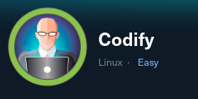

# Codify - Walkthrough



## TARGET : 10.10.11.239
## ATTACKER : OPENVPN IP

## Scanning

`nmap -A -p- -T4 10.10.11.239`

```
PORT     STATE SERVICE VERSION
22/tcp   open  ssh     OpenSSH 8.9p1 Ubuntu 3ubuntu0.4 (Ubuntu Linux; protocol 2.0)
| ssh-hostkey: 
|   256 96:07:1c:c6:77:3e:07:a0:cc:6f:24:19:74:4d:57:0b (ECDSA)
|_  256 0b:a4:c0:cf:e2:3b:95:ae:f6:f5:df:7d:0c:88:d6:ce (ED25519)
80/tcp   open  http    Apache httpd 2.4.52
|_http-title: Did not follow redirect to http://codify.htb/
|_http-server-header: Apache/2.4.52 (Ubuntu)
3000/tcp open  http    Node.js Express framework
|_http-title: Codify
Service Info: Host: codify.htb; OS: Linux; CPE: cpe:/o:linux:linux_kernel
```

## Website

We need to add `codify.htb` to our `/etc/hosts` file.


`gobuster dir -u codify.htb -w /usr/share/wordlists/dirbuster/directory-list-2.3-medium.txt`


## Reverse Shell